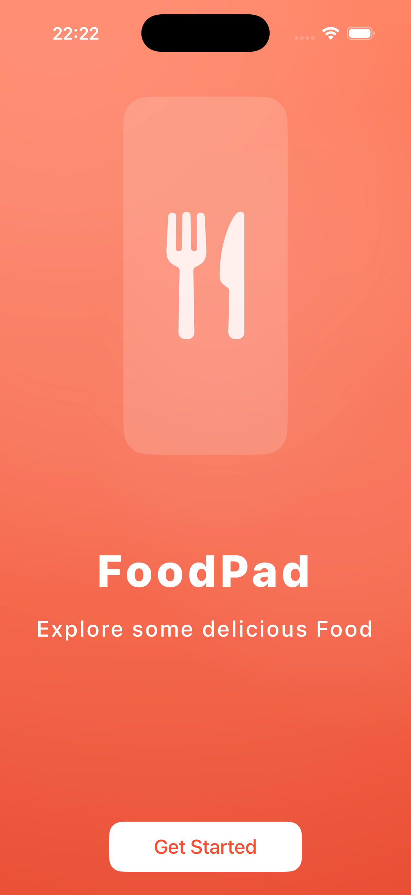
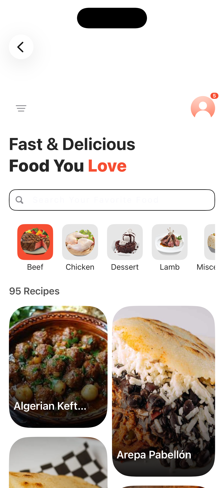
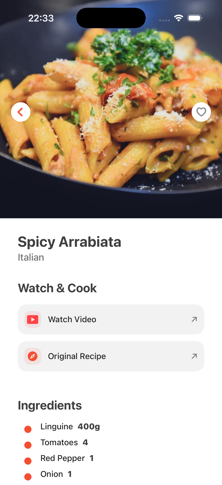
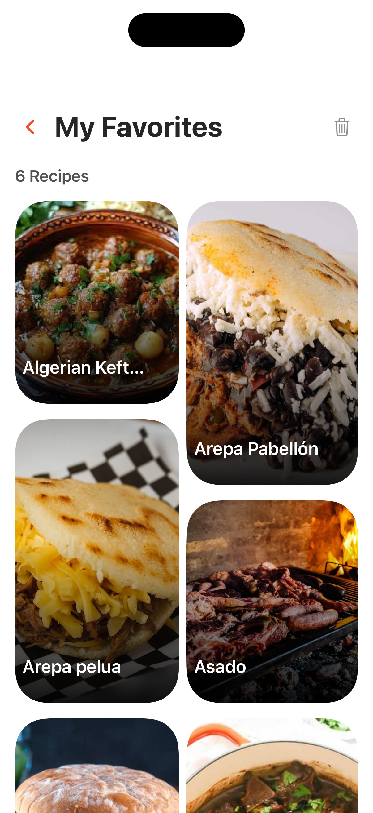
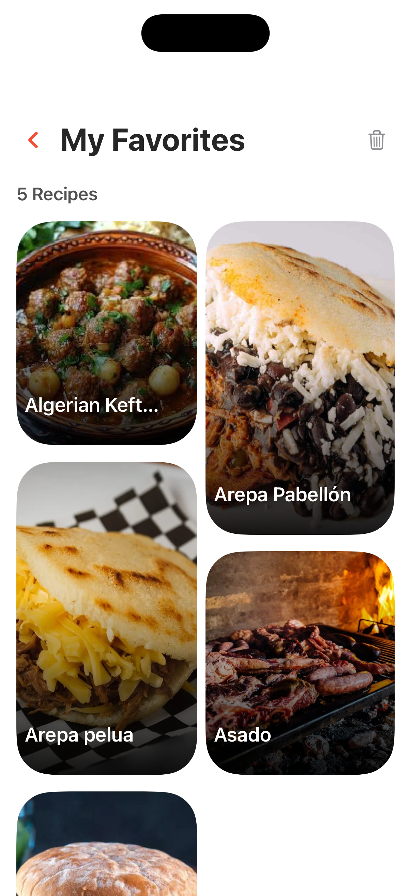
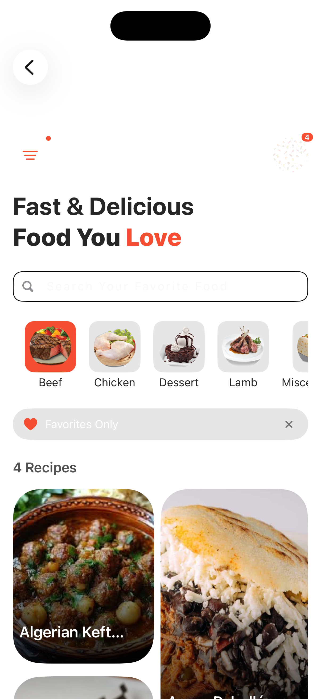
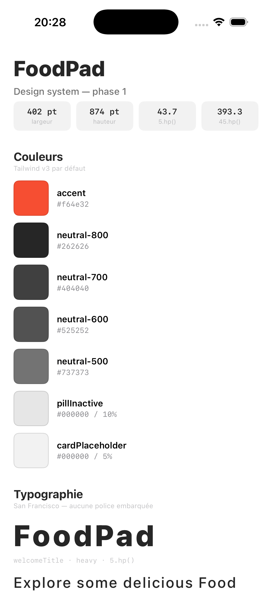

<div align="center">

# 🍳 FoodPad

**Explorez des milliers de recettes, à votre rythme.**

Application mobile de recettes construite avec React Native & Expo.

[](https://reactnative.dev)
[](https://expo.dev)
[](https://www.nativewind.dev)
[](./LICENSE)

</div>

---

## 📱 À propos

FoodPad est une application mobile qui permet de parcourir un large catalogue de
recettes, de les filtrer par catégorie et de consulter le détail de chaque plat
(ingrédients, quantités, instructions).

Le projet est né d'une envie simple : disposer d'un carnet de recettes toujours
à jour, consultable hors ligne et pleasant à utiliser sur téléphone.

### ✨ Fonctionnalités

- **Écran d'accueil animé** — logo Lottie et transition vers l'app en un clic
- **Navigation fluide** — pile de screens native stack, headers masqués, transitions partagées
- **Catégories** — 14 catégories (Bœuf, Poulet, Fruits de mer, Végétarien, Dessert, Vegan…) sélectionnables en un tap
- **Grille en maçonnerie** — 2 colonnes avec hauteurs variables, chargement progressif au scroll
- **Fiche recette détaillée** — image HD, origine du plat, ingrédients avec mesures, instructions
- **Cache d'images** — les images de plats sont converties en base 64 et stockées en `AsyncStorage` pour un affichage instantané
- **Animations Reanimated** — entrées en `FadeInDown` avec spring, image partagée entre les écrans
- **Responsive** — toutes les tailles reposent sur `react-native-responsive-screen`
- **UI NativeWind** — styles utilitaires TailwindCSS, zéro `StyleSheet` manuel

### 🛠 Stack technique

| Couche | Technologie |
| --- | --- |
| Framework | React Native 0.72 + Expo SDK 49 |
| Langage | JavaScript |
| Styles | NativeWind 2 / TailwindCSS 3 |
| Animations | React Native Reanimated 3, Lottie |
| Navigation | React Navigation 6 (native-stack) |
| Réseau | Axios |
| Icônes | Heroicons |
| Grille | @react-native-seoul/masonry-list |
| Stockage | AsyncStorage |
| API | [TheMealDB](https://www.themealdb.com/api.php) — API gratuite de recettes |

### 🔌 API utilisée

Toutes les données proviennent de l'API publique gratuite
[TheMealDB](https://www.themealdb.com/api.php). Aucune clé n'est requise.

| Endpoint | Utilisation |
| --- | --- |
| `GET /categories.php` | Liste des catégories |
| `GET /filter.php?c={catégorie}` | Recettes filtrées par catégorie |
| `GET /lookup.php?i={id}` | Détail complet d'une recette |

---

## 🚀 Installation & lancement

**Prérequis :** [Node.js](https://nodejs.org) 18+, [Expo Go](https://expo.io/go)
installé sur votre téléphone, ou un simulateur iOS / Android.

```bash
# 1. Installer les dépendances
npm install

# 2. Lancer le serveur de développement
npm start
```

Un QR code s'affiche dans le terminal : scannez-le avec **Expo Go** pour ouvrir
l'app sur votre téléphone. Le rechargement est automatique à chaque modification
de fichier.

### Scripts disponibles

| Commande | Action |
| --- | --- |
| `npm start` | Démarre le serveur Expo (QR code + menu) |
| `npm run ios` | Lance et ouvre l'app dans le simulateur iOS (macOS) |
| `npm run android` | Lance et ouvre l'app sur un appareil / émulateur Android |
| `npm run web` | Lance la version web (nécessite `npx expo install react-dom react-native-web`) |

---

## 📁 Structure du projet

```
.
├── App.js                     # Point d'entrée : rendu de la navigation
├── app.json                   # Config Expo (nom, icônes, splash, slug)
├── assets/
│   ├── images/                # Avatar, fond de l'écran welcome
│   ├── lottie/                # Animation du logo
│   ├── icon.png               # Icône de l'app
│   ├── splash.png             # Écran de démarrage
│   └── adaptive-icon.png      # Icône Android
├── src/
│   ├── components/
│   │   ├── Categories.js      # Sélecteur horizontal de catégories
│   │   ├── Loading.js         # Indicateur de chargement
│   │   ├── Recipes.js         # En-tête + grille en maçonnerie
│   │   └── RecipesCard.js     # Carte d'une recette
│   ├── constants/
│   │   └── index.js           # Données statiques (descriptions de catégories)
│   ├── navigation/
│   │   └── index.js           # Stack de navigation (Welcome → Home → RecipeDetails)
│   └── screens/
│       ├── WelcomeScreen.js   # Écran d'introduction animé
│       ├── HomeScreen.js      # Catégories + grille de recettes + recherche
│       └── RecipeDetailsScreen.js  # Fiche détaillée d'une recette
├── utils/
│   └── index.js               # CachedImage : cache base 64 via AsyncStorage
├── babel.config.js            # Config Babel (plugin NativeWind)
├── tailwind.config.js         # Config TailwindCSS
├── ios/                       # Version native SwiftUI
│   ├── FoodPad.xcodeproj/
│   └── FoodPad/
│       ├── FoodPadApp.swift   # Point d'entrée + NavigationStack
│       ├── Theme/             # Couleurs, typo, hp()/wp()      (phase 1)
│       ├── DesignSystem/      # Écran de référence des tokens   (phase 1)
│       ├── Models/            # Meal, Category, Ingredient      (phase 2)
│       ├── Services/          # MealService, cache, favoris     (phase 2)
│       ├── Components/        # MasonryGrid, RecipeCard, Cache, FilterSheet… (5-7, 9)
│       ├── Screens/           # Welcome, Home, RecipeDetails, Favorites (3-6, 9)
│       └── Resources/         # food-logo.json
├── docs/                      # Captures d'écran de la version native
└── scripts/                   # inspect-screenshot.py, generate-assets.py
```

---

## 🔶 Migration native iOS

Une réécriture complète en **Swift / SwiftUI** est en cours, dans le dossier
`ios/`. L'app React Native ci-dessus sert de référence visuelle.

👉 **[MIGRATION_SWIFT.md](./MIGRATION_SWIFT.md)** — plan de travail détaillé :
inventaire de l'app, design system extrait, 9 phases, pièges connus.

| Phase | Statut |
| --- | --- |
| 0 — Socle Xcode | ✅ |
| 1 — Design system | ✅ |
| 2 — Modèle + réseau | ✅ |
| 3 — Welcome | ✅ |
| 4 — Home | ✅ |
| 5 — Grille maçonnerie | ✅ |
| 6 — Fiche recette | ✅ |
| 7 — Cache + finitions | ✅ |
| 8 — Publication | ✅ |
| 9 — Boutons fonctionnels | ✅ |

**10 phases terminées, 22 fichiers Swift (3 556 lignes), 0 avertissement** en Debug
comme en Release. Écarts assumés avec la version RN : favoris persistés (le RN les
perd), recherche rendue fonctionnelle, `useEffect` sans dépendances corrigé,
écran « Mes favoris » et feuille de filtres ajoutés (les boutons qui les ouvrent
ne faisaient rien), et visuels d'origine régénérés (voir plus bas).

### Lancer la version native

```bash
cd ios
xcodebuild -project FoodPad.xcodeproj -scheme FoodPad \
  -sdk iphonesimulator \
  -destination 'platform=iOS Simulator,name=iPhone 17 Pro' \
  -derivedDataPath /tmp/fp-dd build

xcrun simctl install booted /tmp/fp-dd/Build/Products/Debug-iphonesimulator/FoodPad.app

# Démarrage normal, ou jump direct à un écran pour développer :
xcrun simctl launch booted com.armelbogue.foodpad
xcrun simctl launch booted com.armelbogue.foodpad -startScreen home
xcrun simctl launch booted com.armelbogue.foodpad -startScreen favorites
xcrun simctl launch booted com.armelbogue.foodpad -startScreen details

# Injecter des favoris pour voir l'écran correspondant rempli
# (impossible sans ça : le magasin démarre vide et on ne peut pas cliquer)
xcrun simctl launch booted com.armelbogue.foodpad \
  -startScreen favorites -seedFavorites 6

# Capture
xcrun simctl io booted screenshot docs/mon-ecran.png

# Analyse automatique du rendu (sans l'ouvrir)
python3 scripts/inspect-screenshot.py docs/mon-ecran.png
```

Ces arguments de lancement n'existent qu'en configuration **Debug** : le fichier
`Components/DevTools.swift` est entièrement encadré par `#if DEBUG`, et
`-startScreen` n'est lu que dans cette configuration. L'app livrée démarre
toujours sur l'écran d'accueil.


---

## 🎬 Captures d'écran

### Version native (SwiftUI)

| Welcome | Accueil | Fiche recette |
| --- | --- | --- |
|  |  |  |

Écrans ajoutés en phase 9 :

| Favoris | Favoris (vide) | Accueil filtré |
| --- | --- | --- |
|  |  |  |

Écran de référence du design system (phases 0-1) :


### Version React Native

> À compléter — déposez vos captures dans `docs/` et référencez-les ici :
>
> | Welcome | Accueil | Fiche recette |
> | --- | --- | --- |
> | `` | `` | `` |

---

## 🛤 Feuille de route

Terminé côté natif : barre de recherche branchée sur `search.php`, favoris
persistés, cache disque des images, icône et visuels d'en-tête régénérés.

Reste à faire :

- [ ] Ajouter Lottie (`#if canImport(Lottie)` est déjà en place) — la dépendance
      SPM n'a pas pu être résolue depuis cette machine, à faire depuis Xcode
- [ ] Mode hors ligne complet avec cache des réponses JSON
- [ ] Rendre l'app sensible aux autres tailles d'écran : `hp()` est relatif à la
      hauteur, donc le rendu se dégrade hors portrait (voir MIGRATION_SWIFT.md § 5.3)
- [ ] Ajouter un système de notes / commentaires
- [ ] Publier sur l'App Store

---

## 👤 Auteur

**Armel Bogue** — [GitHub](https://github.com)

---

## 📜 Crédits & licence

Ce projet est une adaptation d'un food app open source React Native
initialement publié sur GitHub par **Joe Stacks** — un grand merci à lui pour
le design et la base de code.

- MIT License — voir [`LICENSE`](./LICENSE)
- Recettes et images fournies par [TheMealDB](https://www.themealdb.com/api.php)
- Icônes : [Heroicons](https://heroicons.com) (MIT)

---

<div align="center">
<sub>Construit avec ❤️ en React Native &amp; Expo</sub>
</div>
